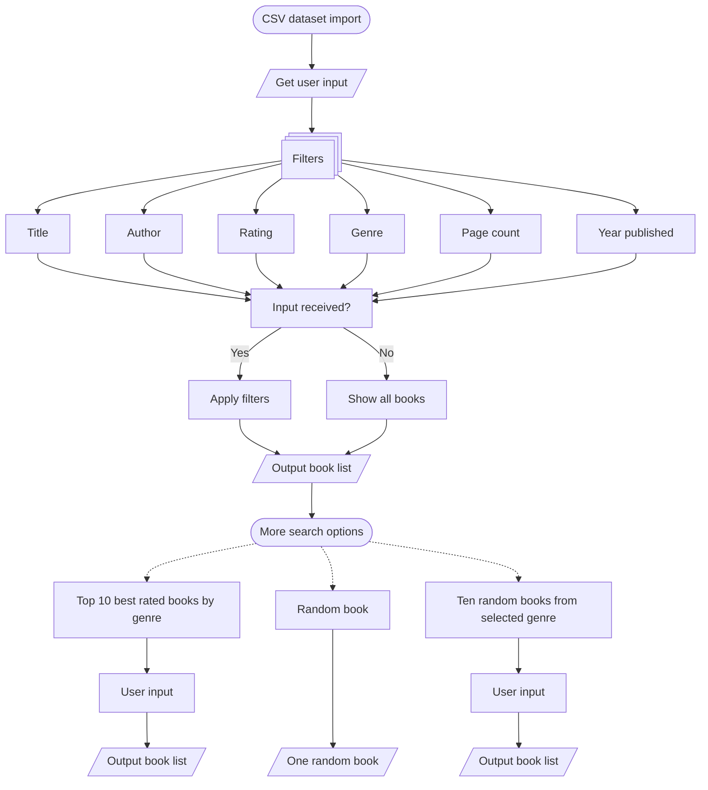

This flowchart illustrates the core decision logic behind the book filtering system, showing how user inputs transform into personalized recommendations. 

Flowchart key: 
- **Rectangles**: Process steps  
- **Stacked rectangles**: Several processes 
- **Parallelogram**: Outputs from searches 
- **Ovals**: Start/End points 
- **Solid arrows**: Primary workflow path 
- **Dashed arrows**: Alternative paths/Optional search  