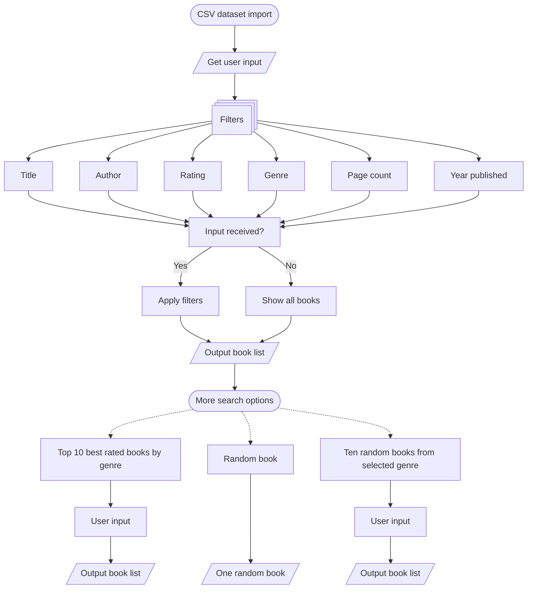

### 1 Project description
**Book search** 📚 is a book search tool on publicly available dataset prepared as a project for a python course. Dataset was accessed on kaggle.com, uploaded by middlelight ([link](https://www.kaggle.com/datasets/middlelight/goodreadsbookswithgenres)). 

### 2 Motivations
As a book enthusiast with limited reading time, I needed a way to quickly find books matching my current reading capacity and interests. 
The most common struggles finding books I had were:
   - 📉 Overwhelming number of books published
   - ⏳ Time wasted reading books that are not good enough fit for my interests
   - 🔎 Difficulty finding books with specific page lengths with good ratings (although this metric has skewness with median around 4 out of 5 ⭐) 
### 3 Requirements
jupyter_client 8.6.3 
jupyter_core 5.8.1 
kaggle 1.7.4.5 
nbformat 5.10.4 
pandas 2.3.3 
plotly 6.4.0 

More specifications can be found in requirements.txt.

### 4 Files
Book_search.ipynb 
graphs_goodreards.ipynb 
readme.md 
requirements.txt 
mkdocs.yml 
docs/ 
   - index.md           
   - about.md            
   - flowchart.md
requirements.txt 
Goodreads_books_with_genres.csv - dataset downloaded from [kaggle database](https://www.kaggle.com/datasets/middlelight/goodreadsbookswithgenres).

### 5 Imports required:
- pandas
- plotly express

### 6 Code flow description
#### 6.1 Book search 📖
Following options for search are available based on user input. If no user input is provided for any of the fields, whole range (rating) or all options (title, author, pages in book and date published) is included in resulting list of books.

Search options:
- Search by **Book title**
- Search by **Author name**
- Search by **Average rating**
- Search by **Genre**
- Search limiting max lenght of books by **Page count**
- Search by **Date published**
#### 6.2 Book recommendations 📖
Book recommendations include 3 possible searches:
- **Top 10 best rated books by genre**
Based on the user input genre top 10 rated books in selected genre are returned.
- **Random book**
Random book from the whole dataset is reruned.
- **Ten random books by chosen genre**
Search returns 10 random books based on genre specified by user.

**Flowchart**
This flowchart illustrates the core decision logic behind the book filtering system, showing how user inputs transform into personalized recommendations.

Flowchart key:
- **Rectangles**: Process steps 
- **Stacked rectangles**: Several processes
- **Parallelogram**: Outputs from searches
- **Ovals**: Start/End points
- **Solid arrows**: Primary workflow path
- **Dashed arrows**: Alternative paths/Optional search 

#### 6.3 Graphical representation of the dataset 📊
Graphical visualisation of dataset was prepared using **pandas** and **plotly.express** libraries.

**Fig 1. Book length distribution** 📄
- A histogram of page count for all books. Interactive hover over the top of the graph shows book information. Highest page count has Aubrey–Maturin series. Most books are not grouped by series.

**Fig 2. Average rating histogram** ⭐
- The average rating of books clusers around 4 stars.
- Table below figure shows descriptive statistics for average book rating, page number and written reviews.

**Fig 3. Genre count** 
- Genres are extracted for each book and used to produce piechart (not ideal representation). Hover over slices shows genres as does scrollable list on the right. This can be used as a help to for genres.

**Fig 4. Average rating of fantasy books and book count** 🐲
- A Histogram showing distribution of book ratings for fantasy genre.

**Fig 5. Correlation of average rating with number of ratings**
- Correlation of average ratings with the number of ratings. Data for number of ratings are log transformed.

**Fig 6. Average rating of books sorted by date**
- A scatter plot showing that books that are most rated were published in last 50 years. But check the Fig 7. The hover over feature shows book title.

**Fig 7. Books published for each year**
- A histogram of books published in time. This appears peculiar since 2006 is a peak, but many books are added not with their original year of publishing but as later editions e.g. The Adventures of Tom Sawyer by Mark twain has publishing date in 2006 but was originally published in 1876.